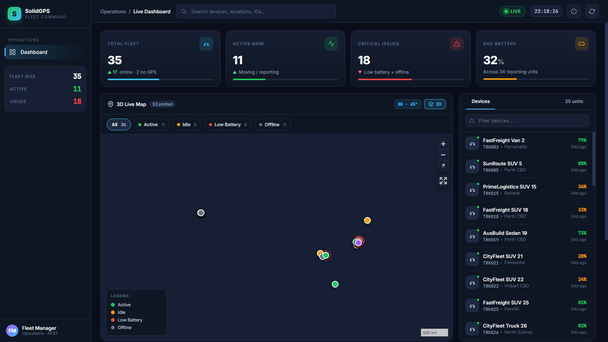

# SolidGPS — Fleet Command Dashboard

> **Technical Challenge Submission** · Built with Python standard library · Zero third-party packages

---

## Dashboard Preview



> *35 live devices across Australia. Color-coded markers, 3D tilted map, real-time KPIs, and an interactive device list — all generated from a single Python script.*

---

## Quick Start

```bash
# No pip install. No virtualenv. Just Python.
python fleet_dashboard.py
# → Opens fleet_dashboard.html in any modern browser
```

**Runtime:** ~0.1 seconds · **Output size:** ~58 KB · **Dependencies:** Python 3.8+ stdlib only

---

## What the Dashboard Does

### KPI Command Strip
Four live metric cards at the top — Total Fleet, Active Now, Critical Issues, and Average Battery — each with a color-coded progress bar so the fleet manager can assess health at a glance.

### 3D Interactive Map
| Control | Action |
|---------|--------|
| Scroll wheel | Zoom in/out |
| Left-click drag | Pan |
| Right-click drag | Rotate + tilt (3D) |
| Click device card | Camera flies to vehicle with popup |
| "3D" toggle button | Switch between 3D (45° pitch) and flat 2D view |
| Compass (top-right) | Reset north/bearing |
| Fullscreen button | Expand map |

- **Dark vector tiles** (CartoDB Dark Matter) for clean, high-contrast rendering
- **Pulsing red rings** on low-battery vehicles — critical alerts you can't miss
- **3D building extrusions** visible when zoomed in to city level

### Filter + Search
- **Filter chips** on the map toolbar (All / Active / Idle / Low Battery / Offline) — updates both the map markers and the device list simultaneously
- **Global search bar** in the topbar — type any device ID, name, location, or status keyword

### Device List Panel
Scrollable, click-to-select list sorted by urgency (Active → Idle → Low Battery → Offline). Each card shows:
- Color-coded status dot
- Vehicle name and ID (monospace)
- Location
- Battery % (red/amber/green)
- "X ago" relative timestamp (refreshes every 30s)
- ⚠ NO GPS badge for invalid coordinates

### Analytics Bottom Row
| Panel | Content |
|-------|---------|
| Recent Activity | Last 8 events with timestamps |
| Status Distribution | Horizontal bar chart with counts |
| Battery Distribution | Vertical histogram (5 bins, 0–100%) with hover tooltips |

---

## Data Quality Handling

The script detects and warns about real-world data issues in `fleet_status.csv`:

| Issue | Device | Handling |
|-------|--------|----------|
| Missing name, GPS, battery | `TRK031` | Flagged in console `[WARN]`, shown with "No GPS" badge |
| Unknown status `maintenance` | `TRK032` | Mapped to `unknown` (purple), reported |
| Non-numeric latitude `not_a_lat` | `TRK034` | GPS excluded, badge shown |
| Future `last_seen` timestamp | `TRK035` | Flagged, displayed as "future" |

---

## My Approach

### How I Used AI to Complete This Task

I used AI (Cascade/Windsurf) as a hands-on engineering partner — not a code generator I blindly copy from. My workflow:

1. **I defined the architecture first.** I decided the approach: one Python script, embedded JSON in HTML, client-side rendering via vanilla JS. AI helped validate this was the right call given the "no external files" constraint.

2. **I directed the iterations.** I started with a minimal working version (CSV → basic HTML table + Leaflet map), then drove targeted upgrades:
   - Round 1: Functional dashboard with map, list, summary
   - Round 2: Modern dark-theme UI with sidebar, topbar, KPI cards
   - Round 3: Replaced Leaflet with MapLibre GL JS for 3D, pitch, building extrusion
   - Round 4: Fixed layout overlaps, removed dead UI, added filter chips to toolbar

3. **I caught and fixed real bugs myself.** The filter chips were overlapping the map panel header — I identified the cause (absolute positioning inside a relative container) and directed the fix (move chips into a proper toolbar row). I also spotted that the fly-to animation needed MapLibre's API (`flyTo` with `LngLat`) rather than Leaflet's.

4. **I verified every output.** After each iteration I ran the script, opened the HTML in the browser, and tested: filtering, search, 3D toggle, device click, pitch readout.

The result is code I understand fully and can debug instantly — not a black box I generated and shipped.

### Colour / Status Logic

| Status | Colour | Hex | Rationale |
|--------|--------|-----|-----------|
| **Active** | Green | `#22c55e` | All good — vehicle is moving and reporting |
| **Idle** | Amber | `#f59e0b` | Worth watching — online but stationary |
| **Low Battery** | Red | `#ef4444` | Act now — device may go dark soon |
| **Offline** | Gray | `#6b7280` | No signal — investigate if prolonged |
| **Unknown** | Purple | `#a855f7` | Bad data or unrecognised status from CSV |

**Battery bar thresholds:** ≥41% green · 16–40% amber · ≤15% red
This matches how most device UIs (phones, sensors) communicate urgency, making it immediately intuitive for any operator.

**Why traffic-light semantics?** Fleet managers are often non-technical operators scanning dozens of devices quickly. A consistent, universally understood colour system removes cognitive load — green means ignore, red means act.

### One Thing I Would Add If This Were a Real Product

**Live WebSocket data feed with geofencing and push alerts.**

Right now the dashboard is a snapshot — great for Monday morning but blind to events that happen while you're watching. I'd add:

1. **WebSocket connection** — devices push updates every 30s; the map and list update in place without page reload
2. **Geofence zones** — draw polygons on the map, configure alert rules (e.g. "alert if TRK015 leaves Melbourne metro")
3. **Notification layer** — browser push + email digest for critical events (battery critical, offline >10 min, geofence breach)
4. **24-hour breadcrumb trails** — click any device to see its route history for the day

This turns the dashboard from a passive status viewer into an active operational tool — the kind that actually prevents vehicles from going dark unnoticed.

---

## File Structure

```
fleet-dashboard-challenge/
├── fleet_dashboard.py    # The script (Python stdlib only)
├── fleet_dashboard.html  # Generated output (~58 KB, self-contained)
├── fleet_status.csv      # Input data (35 devices)
├── screenshot.png        # Dashboard preview
└── README.md             # This file
```

---

## Technical Notes

- **No `pandas`, `folium`, `requests`, or any third-party package** — pure `csv`, `json`, `datetime` from stdlib
- **MapLibre GL JS** loaded from CDN (required for WebGL 3D map rendering — inlining ~600 KB of JS without tooling is impractical)
- **All device data** is embedded as a JSON literal in the HTML `<script>` block — no API calls at runtime
- **Runs in < 1 second** on any machine with Python 3.8+
